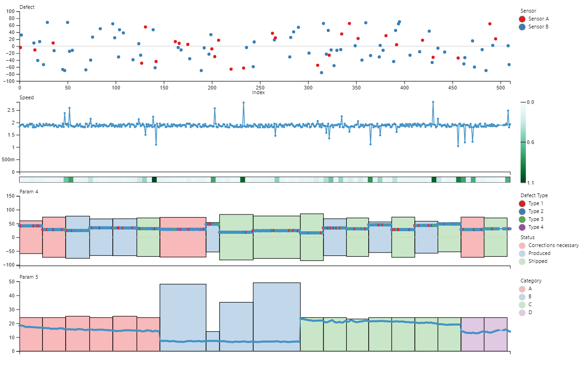

# Multiple Stacked Charts Multiple Categories
This visual is a fork of [Multiple Stacked Charts](https://github.com/jku-vds-lab/pro2future-multiple-stacked-charts) that supports different categorical legends for each plot. 

## Key Features
 - Comparison of multiple measures in one visual
 - Vertical ruler to highlight current X-position in all plots
 - Custom tooltip information that supports text, number and date columns
 - Data points can be colored differently based on categorical data
 - Filtering colored data points by categorical filters
 - Heatmap support for analyzing variations in data
 - Zooming and panning
 - Support for rectangle plot overlays for visualizing segments in data
 - X-axis break and break lines can be toggled
 - Customization of axis labels and ticks, data colors, plot titles, minimum value, maximum value and heatmap for each plot
 - Colored background based on status column possible
 - Different categorical legends for each Plot possible
 - Categorical legends for plot overlays
 - Centering Rectangles along with their data points on the y-axis

